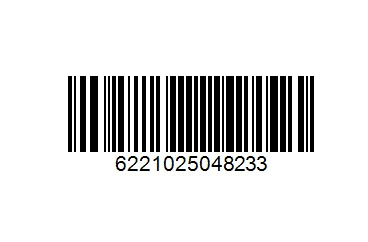
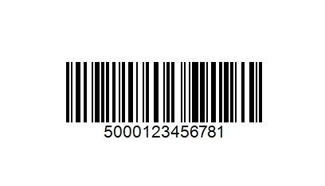
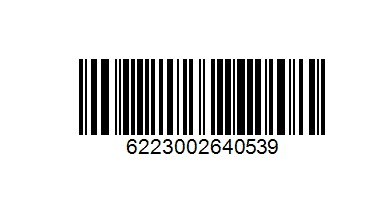

# El Ezaby

A Flutter + Firebase pharmacy shopping app modelled on El Ezaby.

- **Package:** `com.example.elezaby`
- **Firebase project:** `elezaby-6cfd9`

> ⚠️ **Disclaimer:** This is an independent, non-commercial **university project** built for educational purposes only. It is **not** the official El Ezaby Pharmacy app and is **not affiliated with, endorsed by, sponsored by, or connected to El Ezaby Pharmacies** or any of its affiliates. All products, prices, and transactions are fictional demo data — no real orders, payments, or medications are involved. See [Legal / Disclaimer](#legal--disclaimer) below.

## Features

- Browse products by category with Arabic/English names
- Cart and checkout with delivery fee + order tracking
- Favorites and reward points (earned per order)
- Barcode scanning via `mobile_scanner` with simulated AR overlay
- Google Sign-In + email/password auth
- Cached product imagery via `cached_network_image`

## 📱 Download APK

You can install and test the latest version of the app using the APK below:

👉 **Android APK:** [Download El Ezaby APK](https://elezaby-6cfd9.web.app/)

### Installation Notes
- Enable “Install unknown apps” on your Android device if prompted
- Recommended Android version: 8.0+
- Sign in using Google or email authentication after installation
- Requires internet connection for Firebase features

## 🧪 AR Testing Barcodes

Use the following barcodes to test the AR scanning and product recognition feature in the app.

### Product 1: Panadol


### Product 2: Inhaler


### Product 3: NAsal Spray


> Scan these using the in-app barcode scanner to trigger AR overlays and product details.

## 🎬 Project Presentation

This presentation showcases the full development journey of the El Ezaby app, from initial design to final deployment.

👉 **View Presentation:** https://gamma.app/docs/El-Ezaby--nhpragmugbke82j

### Covers:
- User research & problem definition
- UI/UX design process (Figma prototypes)
- System architecture design
- Flutter + Firebase implementation
- AR barcode scanning workflow
- Testing methodology
- Deployment (APK + Firebase Hosting)

> The presentation includes the full project pipeline and AR testing instructions (see slide 7 for barcode testing examples).

## Tech Stack

- **State management:** `provider`
- **Routing:** `go_router`
- **Backend:** Firebase Auth, Firestore, Cloud Functions
- **Scanning:** `mobile_scanner` (runs in its own isolate)

## Project Structure

```
lib/
  main.dart         Firebase init + runApp
  app.dart          MaterialApp.router with GoRouter
  core/             constants, theme, router
  models/           AppUser, Product, Category, CartItem, AppOrder
  services/         Auth, Product, Cart, Order, Reward, Seed
  providers/        Auth, Product, Cart, Favorites, Reward
  screens/          one folder per screen group
  widgets/          reusable widgets
```

## Firestore Collections

- `users/{uid}` — name, email, phone, rewardPoints, firstOrderCompleted, createdAt
- `products/{id}` — name, nameArabic, price, imageUrl, categoryId, barcode, manufacturer, origin, stock, rewardPoints, isOffer, usageSteps, description
- `categories/{id}` — name, emoji, sortOrder
- `carts/{uid}/items/{itemId}` — productId, quantity, price, addedAt
- `favorites/{uid}/items/{itemId}` — productId, addedAt
- `orders/{id}` — userId, items, subtotal, deliveryFee, total, status, rewardPointsEarned, createdAt

## Getting Started

1. Install Flutter (matching the SDK constraint in `pubspec.yaml`).
2. Install deps:
   ```
   flutter pub get
   ```
3. Configure Firebase (generates `firebase_options.dart`):
   ```
   flutterfire configure --project=elezaby-6cfd9
   ```
4. Add your Android debug SHA-1 to the Firebase console (required for Google Sign-In).
5. Deploy backend pieces as needed:
   ```
   firebase deploy --only firestore:rules
   firebase deploy --only functions
   ```
6. Run the app:
   ```
   flutter run
   ```

## Theme

| Token | Value |
|---|---|
| Primary blue | `#0087C8` |
| Dark blue | `#006FA8` |
| Light blue bg | `#EAF8FC` |
| Lighter blue bg | `#D5F1FA` |
| Bottom nav bg | `#DDF5FC` |
| Dark text | `#30343B` |
| Muted text | `#9AA5B0` |
| Green (rewards) | `#20A766` |
| Red badge | `#FF3B30` |

## Deployment

The app is deployed to Firebase Hosting for the `elezaby-6cfd9` project.

### Web build + hosting

```
flutter build web --release
firebase deploy --only hosting
```

The `public/` directory is the configured hosting target (see `firebase.json`). Build artifacts from `build/web` should be copied/pointed there before deploy.

### Backend pieces

Deploy independently as they change:

```
firebase deploy --only firestore:rules
firebase deploy --only firestore:indexes
firebase deploy --only functions
firebase deploy --only storage
```

Full deploy (all targets):

```
firebase deploy
```

### Pre-deploy checklist

- `flutter analyze` exits clean.
- `firebase_options.dart` is up to date (`flutterfire configure` if not).
- Android release SHA-1 added to Firebase console for Google Sign-In.
- App Check debug tokens registered for any dev/emulator clients.
- Cloud Functions deployed **before** clients that depend on new callable signatures.

## Development Notes

- Run `flutter analyze` after every change — the project requires zero warnings.
- All async Firebase calls must surface loading / error / empty states.
- Never block the UI isolate; keep scanning and heavy work off the main thread.

## Legal / Disclaimer

**Notice of Non-Affiliation and Educational Use**

This software ("the App") was developed by students as part of a university course project, for educational and demonstration purposes only. It is a prototype and is **not** a real, official, or commercial product.

- **No affiliation.** The App is not affiliated with, authorized by, endorsed by, sponsored by, or in any way officially connected to El Ezaby Pharmacies, its owners, subsidiaries, or affiliates. Any reference to "El Ezaby" is used purely as a subject of academic study and does not imply any partnership or official relationship.
- **Trademarks.** "El Ezaby" and any associated names, logos, brand elements, and trademarks are the property of their respective owners. They are referenced here under educational/fair-use principles solely to demonstrate app-development concepts. No claim of ownership is made over these marks.
- **No real commerce.** All products, prices, stock levels, rewards, and orders shown in the App are fictional, seeded test data. The App does **not** sell or deliver any real products, does **not** process real payments, and does **not** dispense or provide access to any actual medication.
- **Not medical advice.** Any health, dosage, or medication-usage content is illustrative sample content only and must **not** be relied upon as medical or pharmaceutical advice. Always consult a licensed pharmacist or physician.
- **No warranty / no liability.** The App is provided "as is," without warranty of any kind. The authors accept no liability for any use of, or reliance on, this educational prototype.
- **Takedown.** If you are a rights holder and believe this educational project infringes your rights, please contact the authors and the material will be promptly modified or removed.
